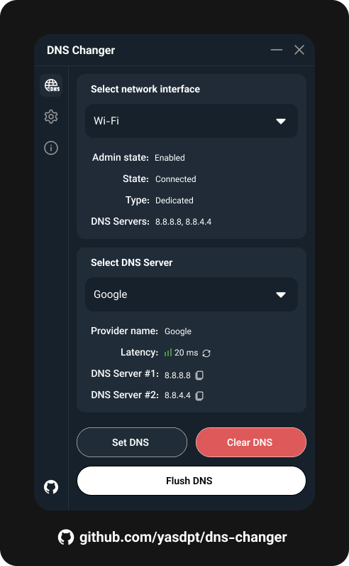

<p align="center">
  <a href="https://yasdpt.ir"></a>
</p>
<h1 align="center">DNS Changer</h1>

<p align="center">
<a href="https://telegram.org" target="_blank"></a>
 

<div align="center">
  <a href="https://github.com/yasdpt/dns-changer/releases">Releases</a>
  <span>&nbsp;&nbsp;•&nbsp;&nbsp;</span>
  <a href="https://github.com/yasdpt/dns-changer/issues">Issues</a>
  <br />
</div>

## What is DNS Changer?

This is a DNS Changer application for Windows and Linux. This application can help those who are gamers and developers to switch between gaming and programming DNS servers easily.

### Quick links

- [Introduction](#what-is-dns-changer)
- [Screenshots](#screenshots)
- [Installation](#installation)
  - [Windows](#windows)
  - [Linux](#linux)
    - [Manual installation](#manual-installation)
  - [Mac](#mac)
- [Contribution](#contribution)
  - [Setup](#project-setup-instructions)
- [License](#license)

## Screenshots

<p align="center">
  <a href="https://yasdpt.ir"></a>
</p>

## Installation

Follow bellow instructions to install the application on your device.

### Windows

You can download the windows version by going to the [Releases](https://github.com/yasdpt/dns-changer/releases) page and downloading the .exe setup file.

### Linux

Run the command bellow in your terminal to install the application on Debian based distros, Other distros support coming soon.

```bash
curl -fsSL https://raw.githubusercontent.com/yasdpt/dns-changer/master/install.sh | sudo bash
```

#### Manual installation

##### Requirements

- `ayatana-appindicator3-0.1` or `appindicator3-0.1`

Run the following command

```bash
sudo apt-get install libayatana-appindicator3-dev
```

Or

```bash
sudo apt-get install appindicator3-0.1 libappindicator3-dev
```

Download the tar.gz file from [Releases](https://github.com/yasdpt/dns-changer/releases) page, decompress and install in your desired location.

cd into the apps location and run

```bash
sudo chmod +x dns_changer
```

And now you can run and use the application!

### Mac

Coming soon...

## Contribution

You can fork the project make your own changes and create a pull request.

### Project setup instructions

- Clone the project.
- Run ```flutter pub get``` to get the dependencies.
- Run ```dart run build_runner build --delete-conflicting-outputs```.
- If you're using linux as your development environment refer to [Linux requirements](#requirements) section and install the appindicator package.
- Start editing!

## License

This project is licensed under the GPL-3.0 license.
